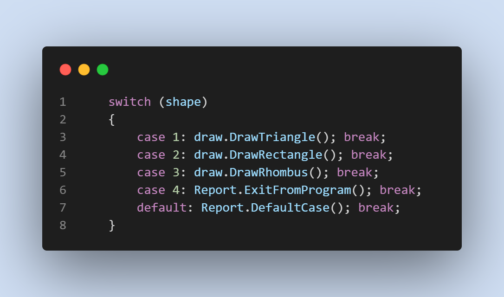
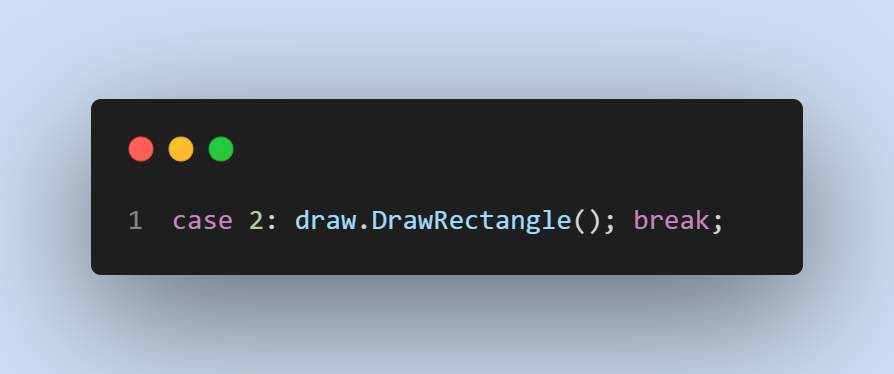

# DrawShapes

We are thrilled to introduce the first release of our Console Shape Drawing App - an innovative tool that allows users to unleash their creativity and engage in the art of shape creation using the power of the asterisk (*).

Have a look at `Program.cs` file and you can see how I have used:

1. Console input/output =>

    

2. Switch statement =>

    

3. Foor Loop =>

    

4. `Methods` => I create several **_methods_** and programm refactored with these methods.

    * Creating method:

        

    * Calling method:

        

5. `Class` => I create three class and move all `methods` into these classes. As a result, I managed to make 134 lines of code into 25 lines. But the function of the program has not changed at all.

    

6. Result =>

    

## How can you run this code in your laptop?

1. You should go my *Github* profile and repository which is named **[DrawShapes](https://github.com/JohnnySenior/DrawShapes)**.

2. Click green butten and you can watch my instruction **[video](https://www.loom.com/share/9cebefe04b8b40f0bb6c48f87f58ad59?sid=fdb619c9-6bf3-4cf8-bb5b-a907855b4625)**.

## Release Note

### V1.0

We are excited to announce the release of version 1.0 of our DrawShapes App! This release introduces how you can draw various shapes.

Features Added:

* **Dynamic Shape Height**: Say goodbye to fixed-size shapes! Our Console Shape Drawing App lets you specify the height of the shape you want to draw, providing you with the flexibility to craft both intricate and larger-than-life designs.

* **Variety of Shapes**: Choose from a curated selection of shapes, including triangles, rectangles, and more. Each shape is dynamically generated based on the height you provide, resulting in stunning visuals that adapt to your creative vision.

How to use:

* Launch the app via the command line.
* Choose your desired shape from the menu.
* Input the height of the shape you wish to draw.
* Watch as the app generates your chosen shape in all its asterisk-filled glory!

Feedback and Support:

We value your input! If you encounter any issues, have suggestions for improvements, or want to share your artistic creations, please don't hesitate to reach out to our support team at jamshidbektursunboev@gmail.com.

Note: You are in **_Version 1.0_** now.